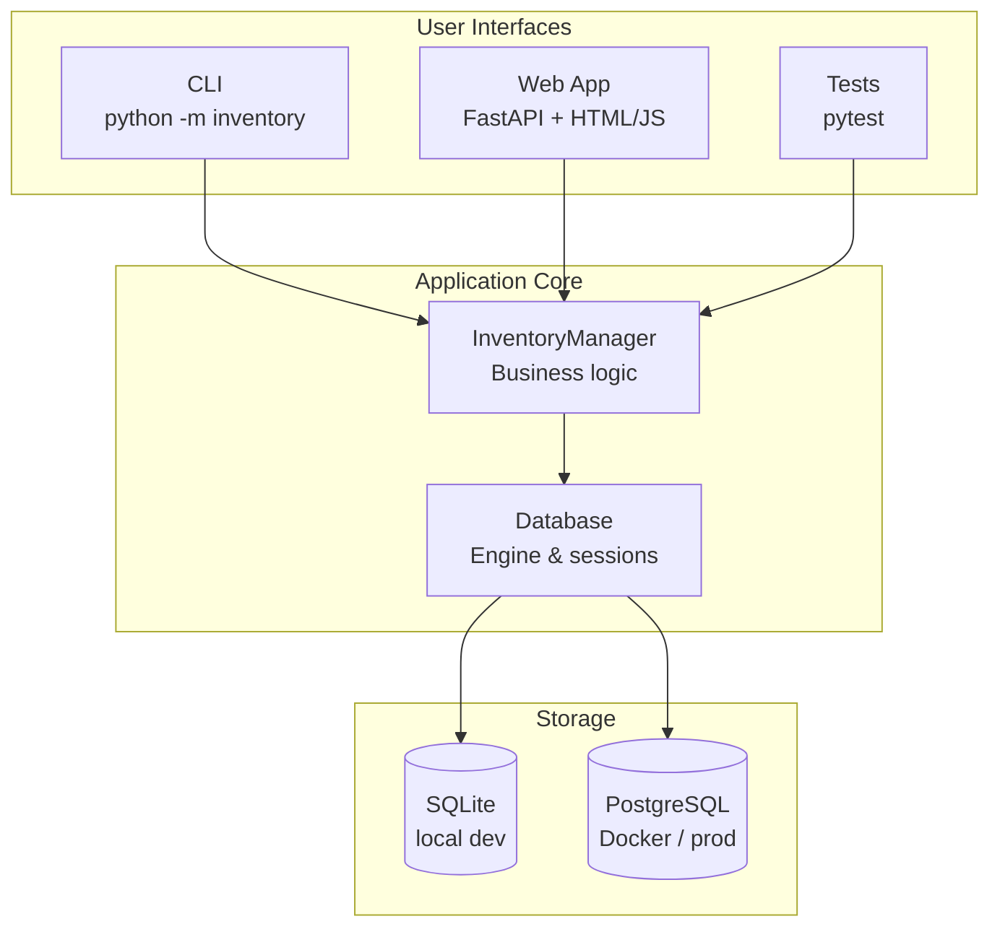
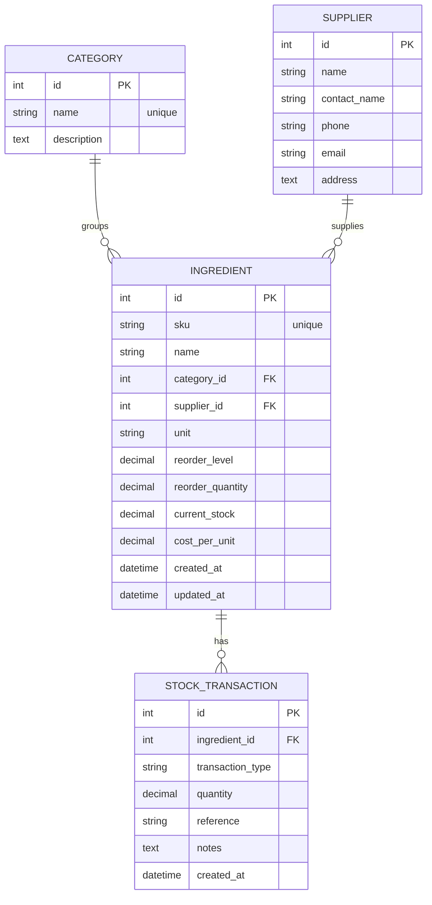
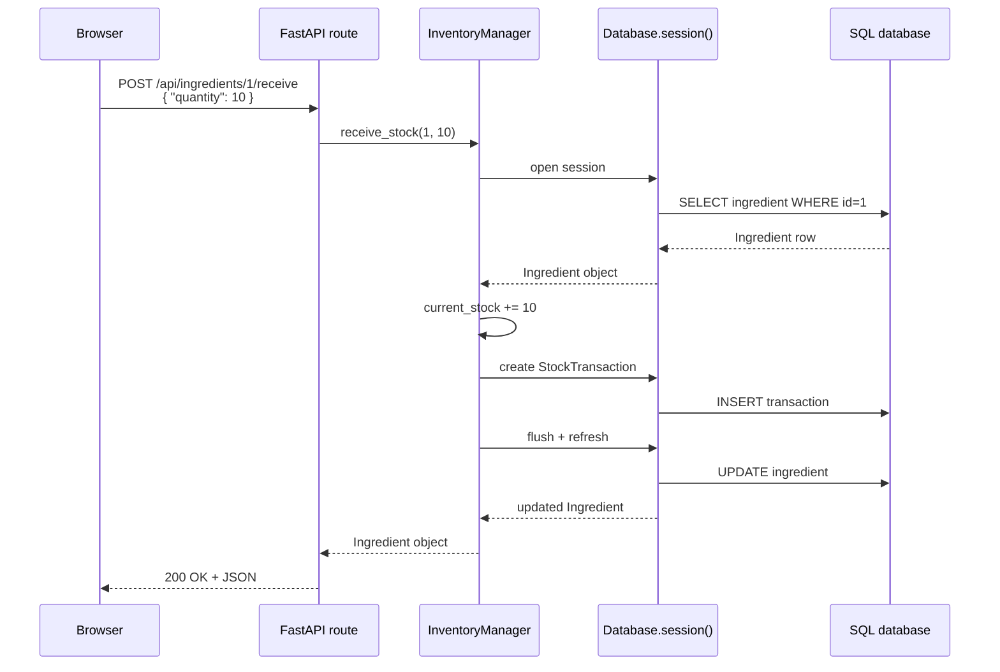
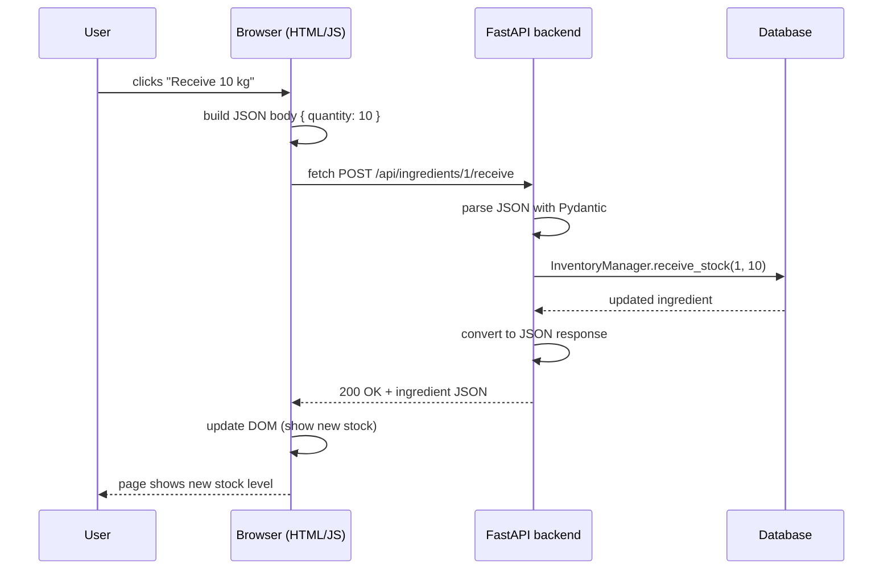
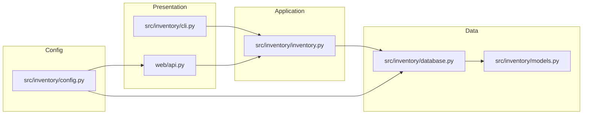

# Architecture

This document explains the architecture of the restaurant inventory system
using visual diagrams.

## High-level system architecture

The diagram shows that the user interface (CLI, web, tests) never talks to the
database directly.  All data access goes through `InventoryManager`, which
keeps business rules in one place.

## Database entity-relationship diagram

- A **Category** groups many **Ingredients**.
- A **Supplier** supplies many **Ingredients**.
- An **Ingredient** has many **StockTransactions** (its audit trail).

## Sequence diagram: receiving stock

This diagram shows what happens when the web API receives a `POST
/api/ingredients/1/receive` request.

Notice that the whole operation is one database transaction.  If anything
fails, the context manager rolls back both the stock update and the audit row,
keeping the data consistent.

## Frontend / backend request flow

This is the typical modern web-app pattern:

1. The browser sends JSON over HTTP.
2. The backend validates the JSON, runs business logic, and talks to the DB.
3. The backend returns JSON.
4. The browser updates the page without reloading it.

## Layered code organisation

Each arrow means "depends on" or "uses".  The important rule is that arrows
only point downward: the CLI depends on the service layer, but the service
layer does not depend on the CLI.  This is what makes the code easy to test and
reuse.
